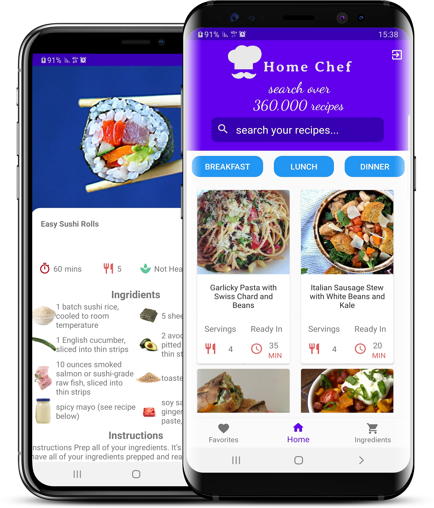

# Home Chef

Home Chef is the best solution for people who are bored of the cooking the same four meals every week or tired of ordering food. It is an android application that offers over 360,000 different recipes using <a href=https://spoonacular.com/food-api>Spoonacular API</a>.  
With Home Chef the user can see a random recipes, search recipies by ingredients that are available at home and more.

### Features
* Easy to Use
* Search recipes by ingredients or title
* Save your favorite recipes
* Filter recipes by type of meal
* Login to your account from any device
* Completely free and ad-free

### Technologies
* Java
* Android Studio
* Spoonacular API
* Firebase

"
"
"
"
"
[3-5](https://user-images.githubusercontent.com/101616106/215674260-4d4769d8-066f-4ab1-b094-6ec89f10784d.PNG)"
